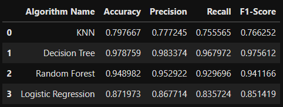
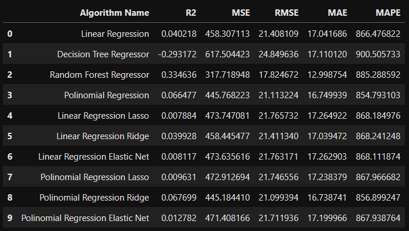
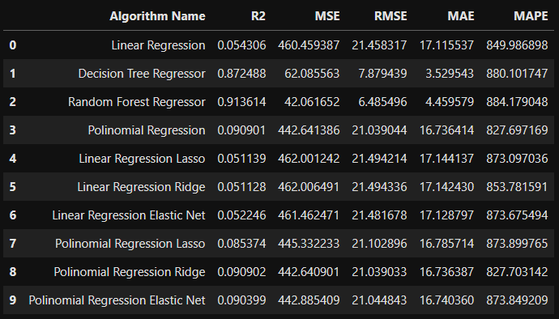
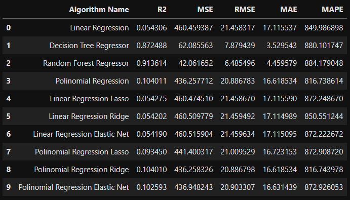
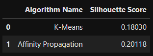

  

# Machine Learning Essay

## Description

The Data Money company believes that expertise in training and adjustment
of algorithms, made by the company's Data Scientists, is the
main reason for the excellent results that consultancies provide
delivering to your customers.

## Goal

The objective of this project will be to carry out tests with
Classification, Regression and Clustering, to study the change in
performance behavior, as the values of the main
Overfitting and underfitting control parameters change.

# Solution planning

## Final product

The final product will be 7 tables showing the performance of the algorithms,
evaluated using multiple metrics, for 3 data sets
different types: Training, validation and testing.

## Tested algorithms

### Classification:

Algorithms: KNN, Decision Tree, Random Forest and Logistic Regression
Performance metrics: Accuracy, Precision, Recall and F1-Score

### Regression:

Algorithms: Linear Regression, Decision Tree Regressor, Random Forest
Regressor, Polynomial Regression, Linear Regression Lasso, Linear
Regression Ridge, Linear Regression Elastic Net, Polynomial Regression
Lasso, Polynomial Regression Ridge and Polynomial Regression Elastic Net
Performance metrics: R2, MSE, RMSE, MAE and MAPE

### Grouping:

Algorithms: K-Means and Affinity Propagation
Performance metrics: Silhouette Score

## Tools used

Python 3.11.3 and Scikit-learn

# Development

## Solution strategy

For the purpose of testing Machine Learning algorithms, I will
write the codes using the Python language, to train each one
of the algorithms and I will vary their main adjustment parameters
overfitting and observe the final metric.
The set of values that make the algorithms achieve the best
performance, will be those chosen for the final training of the
algorithm.

## The step by step

Step 1: Division of data into training, testing and validation.

Step 2: Training the algorithms with the training data,
using the “default” parameters.

Step 3: Measure the performance of algorithms trained with the parameter
default, using the training data set.

Step 4: Measure the performance of algorithms trained with the parameter
“default”, using the validation data set.

Step 5: Toggle the values of the main parameters that control the
overfitting the algorithm until the set of parameters is found
the best performance of the algorithms.

Step 6: Merge training and validation data

Step 7: Retrain the algorithm by joining the training data and
validation, using the best values for the control parameters
of the algorithm.

Step 8: Measure the performance of algorithms trained with the best
parameter, using the test data set.

Step 9: Evaluate the essays and write down the 3 main Insights that came up
highlighted.

# The top 3 Insights

### Insight Top 1

Tree-based algorithms have better performance
in all metrics, when applied to test data, in
Classification test.

## Insight Top 2

The performance of classification algorithms on data
validation was very close to the performance on the test data.

## Insight Top 3

All regression algorithms did not present good performance metrics.
performance, which shows a need for a selection of attributes
and better preparation of the independent variables of the set of
data.

# Results

## Classification test:

### About training data

### About validation data

### About test data

## Regression testing:

### About training data

### About validation data

### About test data

## Clustering assay:

# Conclusion

In this Machine Learning test, I was able to gain experience and
better understand the limits of algorithms between states of
underfitting and overfitting.
Tree-based algorithms are sensitive to the depth of the
growth and number of trees in the forest, making the
correct choice of the values of these parameters prevents the algorithms from
enter the state of overfitting.
Regression algorithms, on the other hand, are sensitive to the degree of
polynomial. This parameter controls the threshold between the underfitting state
and overfitting of these algorithms.
This Machine Learning essay was very important to deepen the
understanding of how different algorithms work
classification, regression and clustering and what are the main parameters
control between underfitting and overfitting states.

# Next steps

As the next steps of this test, I intend to test new algorithms
of Machine Learning and use different data sets to increase
knowledge about algorithms and which scenarios are most favorable
to increase their performance.
